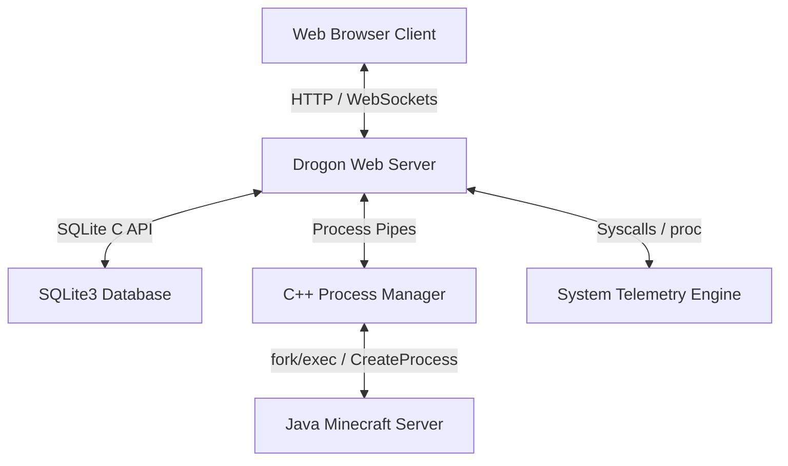

# MCDeploy: Dedicated Minecraft Server Dashboard

**MCDeploy** (also referred to as **MinecraftDeploy**) is a native C++ web control panel and management dashboard for Minecraft servers. Built for maximum execution efficiency, security, and low resource footprint on Linux dedicated servers or VPS systems, MCDeploy uses the **Drogon C++ Framework** for HTTP/WebSocket routing, **SQLite3** for configuration persistence, and a modern **React.js + Tailwind CSS** SPA frontend for admin interfaces.

---

## Technical Architecture Overview

The system architecture is split into a native C++ daemon backend and a compiled single-page frontend served asynchronously:



### Key Components
1. **Drogon C++ Web Server**: High-performance asynchronous non-blocking routing library driven by Trantor event loops.
2. **Process Manager**: Handles spawning server instances in dedicated directories, redirecting input streams to accept console commands, logging stdout channels, and detecting crashes to auto-restart.
3. **Telemetry Engine**: Gathers system core metrics, disk speeds, RAM heaps, and parses console logs to compute real-time Ticks Per Second (TPS) and MSPT metrics.
4. **SQLite3 Layer**: Schema manager executing safe, parameterized queries for user authentication, server properties, backups, and administrative audits.

---

## Features

- **Global Overview**: Real-time system load graphs, total player tallies, and cluster-wide memory usage metrics.
- **Guided Setup Wizard**: Multi-step wizard supporting **PaperMC**, **Purpur**, and **Vanilla** versions with automatic build downloads.
- **Live WebSocket Terminal**: High-fidelity terminal emulator streaming log lines with color coding ([INFO], [WARN], [ERROR]) and processing console command entries.
- **Online Config Editor**: Key-value parser to update `server.properties` and other configuration files directly from the browser.
- **Audit System**: Administrative audit log tracking every user login, starting/stopping action, and properties change.
- **Auto-Crash Recovery**: Detects game process failure exits and automatically triggers clean restarts.

---

## Installation & Build Instructions

### 1. Prerequisites (Debian/Ubuntu Linux)
To compile the C++ server binary, install the required compilers and packages:
```bash
sudo apt-get update
sudo apt-get install -y build-essential cmake libsqlite3-dev libcurl4-openssl-dev libssl-dev libboost-all-dev
```
*Note: Make sure to follow the official [Drogon installation instructions](https://github.com/drogonframework/drogon) to compile and install Drogon on your build system.*

### 2. Building the C++ Backend
Use CMake to configure and build the C++ daemon:
```bash
cmake -B build -S .
cmake --build build --config Release
```
This generates the native execution binary `mcdeploy` under the `build` directory.

### 3. Building the React Frontend
Install dependencies and compile the single-page application bundle:
```bash
cd frontend
npm install
npm run build
```
This compiles assets to the `./dist` folder. The C++ application reads compiled assets from this folder to serve them to clients.

### 4. Running the Application
Start the compiled backend binary from the repository root:
```bash
./build/mcdeploy
```
Open your browser and navigate to `http://localhost:8082`.
*Default credentials:* `admin` / `admin123`

---

## Deploying as a Systemd Service

To deploy MCDeploy as a background systemd daemon on Linux, use the provided `mcdeploy.service` template:

1. Copy the executable and configuration to `/opt/mcdeploy`:
   ```bash
   sudo mkdir -p /opt/mcdeploy
   sudo cp ./build/mcdeploy /opt/mcdeploy/
   sudo cp ./config.json /opt/mcdeploy/
   sudo cp -r ./dist /opt/mcdeploy/
   ```
2. Create a dedicated user for process execution sandboxing:
   ```bash
   sudo useradd -r -s /bin/false mcdeploy
   sudo chown -R mcdeploy:mcdeploy /opt/mcdeploy
   ```
3. Register the service file:
   ```bash
   sudo cp mcdeploy.service /etc/systemd/system/
   sudo systemctl daemon-reload
   sudo systemctl enable mcdeploy
   sudo systemctl start mcdeploy
   ```

---

## Security Hardening Guide

To protect your MCDeploy instance in production environments:
- **Change Default Admin Password**: Create a new account or update the password immediately upon first login.
- **Change JWT Secret**: Edit the `"jwt_secret"` string in `config.json` to be a long random string.
- **Configure HTTPS**: Enable SSL in `config.json` by specifying paths to TLS certificates (e.g. from Let's Encrypt).
- **Run Non-Root**: Never start `mcdeploy` as `root`. Run it as a dedicated user (such as `mcdeploy`) to prevent privilege escalations.
- **Port Firewalls**: Restrict access to port `8082` using `ufw` or `iptables` to white-listed IP addresses, or route it through a secure reverse proxy like Nginx.
